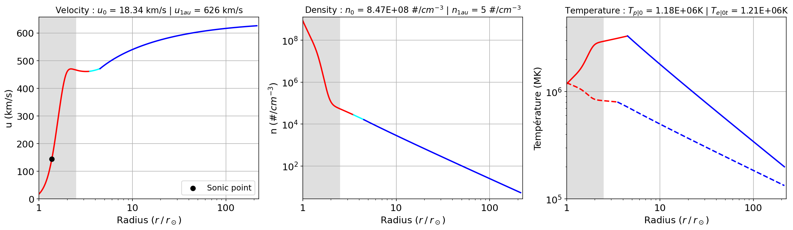

## BipolySolarWind

This repository extend the **_IsopolySolarWind_** respository that can be found on the same Github profile. 
The **_BipolySolarWind_** respository contains Python codes which solve two-fluids hydrodynamic solar wind equations with two distinct polytropic thermal regimes per specie (proton and electron), for a 1D radial trans-sonic flow in spherical expansion, including super-radial expansion, based on Eugene Parker's theory of the solar wind ([Parker 1958](https://ui.adsabs.harvard.edu/abs/1958ApJ...128..664P/abstract), [Parker 1960](https://ui.adsabs.harvard.edu/abs/1960ApJ...132..821P/abstract)) and expansion factor modeling ([Kopp & Holzer 1976](https://ui.adsabs.harvard.edu/abs/1976SoPh...49...43K/abstract)).

The codes follows the recent "bipoly" Parker's-like model by [Dakeyo et al. (2025a)](https://ui.adsabs.harvard.edu/abs/2022ApJ...940..130D/abstract), which model two consecutive polytropic evolution seperated by a so-called polytropic radius $r_{poly|s}$, and this for each specie 's={p,e}' (protons and electrons). It also include the expansion factor influence on Parker's like modeling, recently treated by [Dakeyo et al. (2024b)](https://arxiv.org/abs/2408.06155) accounting for the expansion factor modeling in the near Sun region, and the resulting "f-subsonic" and "f-supersonic" solutions, respectively subsonic and supersonic in the super-expansion region. This split of solution is due to the deLaval nozzle effect applied on the wind expansion ([Kopp & Holzer 1976](https://ui.adsabs.harvard.edu/abs/1976SoPh...49...43K/abstract)), that induces two possible critical radius values for a single coronal temperature value. 

The code organigram is identical to that of the **_IsopolySolarWind_** repository.
There are three main files : `function_to_run_bipoly_dakeyo2024b`, `bipoly_solar_wind_solve_and_plot` and `main_bipoly_dakeyo2024b`. All the files must be stored in the same respository for the execution. The former contains the functions to solve the equations themselves, the second file runs the solver and plots the solution, and the latter is the main code for the user, which takes the inputs of the model, runs the first two files to display the solutions, and provides the output bipoly parameters. An example of the use of the main code `main_bipoly_dakeyo2024b` is provided in the Jupyter Notebook `ExampleNotebook.ipynb`. 

The bipoly equations are solved by a finite difference scheme (explicit method), for two consecutive thermal regimes per species (protons and electrons). The first thermal regime is defined by the polytropic indexes $\gamma_{s0}$ over the species $s = {p,e}$, and the second thermal regime by the indexes $\gamma_{s1}$. Specie thermal behavior are fully decoupled from eachother, i.e. $r_{poly|p}$, $\gamma_{p0} and $\gamma_{p1} can be set independently to $r_{poly|e}$, $\gamma_{e0}$ and $\gamma_{e1}$, respectively. The combination of input parameters results in a large amount of local thermal regimes combination:

* A single fluid fully isothermal solar wind : ($\gamma_{p0} = \gamma_{p0} = 1$) and ($r_{poly|p} = r_{poly|e} = \infty$) <details><p> - This follows [Parker 1958](https://ui.adsabs.harvard.edu/abs/1958ApJ...128..664P/abstract), in which the solar wind fluid is held at a fixed temperature (equivalent version also available at [https://github.com/STBadman/ParkerSolarWind](https://github.com/STBadman/ParkerSolarWind)). See **_IsopolySolarWind_** or for more details.</p></details>

* A two fluid isopoly solar wind with single transition : ($\gamma_{s0} = 1$, $\gamma_{s1} \neq 1$), and ($r_{poly|p} = r_{poly|e}$) <details><p> - Here, the solar wind temperature is allowed to cool with heliocentric distance, as is observed to actually occur in the solar wind (e.g. [Dakeyo et al. (2022)](https://ui.adsabs.harvard.edu/abs/2022ApJ...940..130D/abstract). 
This consists of an initial isothermal evolution (isothermal layer) up to a boundary distance called the "polytropic radius" $r_{poly}$, which can be interpreted in a first approximation as the region to which the coronal heating extends. In the present solution case, both protons and electrons share the same transition, i.e. $r_{poly|p} = r_{poly|e}$. 
For $r \gt r_{poly}$, the solar wind is constrained to follow a polytropic evolution which is initialized by the outer boundary conditions of the isothermal region. 
For most combinations of physical conditions, the trans-sonic critical point is located within the isothermal region. As long as the isothermal boundary is at sufficiently high altitude that the solar wind stays super-sonic at the transition to polytropic behavior, the solution remains on the asymptotically accelerating solution branch and a reasonable solar wind solution is obtained. The unphysical discontinuity at the regime transition can be smoothed by considering slowly varying polytropic indexes at the transition between the two regions, but this feature is not addressed here. </details></p> 

* A two fluid isopoly solar wind with double transition ($\gamma_{s0} = 1$, $\gamma_{s1} \neq 1$), and ($r_{poly|p} \neq r_{poly|e}$) <details><p> - This case is closely similar to the single transition solution, at the difference that protons and electrons do not share the same isothermal radius. </details></p>

* A two fluid bipoly solar wind with double transition ($\gamma_{s0} = 1$, $\gamma_{s1} \neq 1$), and ($r_{poly|p} \neq r_{poly|e}$) <details><p> - This case is closely similar to the single transition solution, at the difference that protons and electrons do not share the same isothermal radius. </details></p>

All the thermal regimes can be declined in both "f-subsonic" and "f-suersonic" type of solution, depending the influence of the expansion factor profile. 
* f-subsonic solutions <details><p> -  The f-subsonic solutions are the more commonly used in solar wind modeling and space weather. They embed relatively slowly accelerating wind, and a critical radius location between 3 and 8 $r_\odot$ for coronal temperature of the order of 0.5 - 3 MK. For this type of solution, the influence of the expansion factor is to create a deceleration region within the super-expansion region. 
* f-supersonic solutions <details><p> - The f-supersonic solutions are known, but less used in the space weather community. They induce a rapidly accelerating solar wind solution with a critical radius very close to the Sun inside the super-expansion region, ranging between 1 and $\sim$ 3 $r_\odot$, for coronal temperatures of the order of 0.5 - 3 MK.  They also induce a deceleration region, but approximately from the end of the super-expansion region to $\sim$ 8 $r_\odot$.  </details></p>

The numerical and physical justification for the choice between the two solutions depends on the determination of the critical radius, which must respects the requirements of the transonic solutions.  More details are available in [Dakeyo et al. (2024b)](https://arxiv.org/abs/2408.06155). 
Recommendations for appropriate isopoly input values are provided at the end of the `ExampleNotebook.ipynb` file in the repository.


Since all solutions are computed with the same set of codes, each of the above solutions can be obtained by modifying the inputs parameters. The `main_iso_poly_dakeyo2024b` code returns an array of heliocentric distances ($r$ in solar radii), density ($n$ in #.$cm^-3$ ), fluid velocity ($u$ in km/s), fluid temperatures ($T_p$ and $T_e$ in Kelvin), expansion factor profile ($f$) and a bolean mentionning if this is a "f-supersonic" type solution (bol_super=0 $\rightarrow$ f-subsonic, bol_super=1 $\rightarrow$ f-supersonic). 

All the outputs are `numpy array`. 

In the following example we solve and plot an f-subsonic isopoly solution with double transition. All thermal regimes related to the evolution of the two species (proton and electron) are indicated by a different color: the fully isothermal region is in red, the region after the first thermal transition (one species isothermal and the other polytropic) is in light blue, and the region after the second thermal transition (fully polytropic) is in blue. 

```python
# Importation required to run this code
import bipoly_solar_wind_solve_and_plot as bpsw
import streamline_calc_dakeyo2024a as stream 
import matplotlib.pyplot as plt
#########################################
# Inputs of the model : Isopoly 
#########################################

# Length of the output model
N = 2e4         # (Note : the number of points N has been inscreased compared to previous cases)
L = 1.496e11      # set to 1au by default

# Polytropic indexes
gamma_p_values = [0.905, 1.35] 
gamma_e_values = [1.040, 1.21]

# Coronal temperature
Tpc = 1.575e6
Tec = 1.070e6

# Isothermal radius (in solar radii)
r_poly_p = 4.5
r_poly_e = 3.5

# Expansion factor parameters
fm = 100
r_exp = 1.9          # in solar radii
sig_exp = 0.1       # in solar radii
#########################################
# Plotting option 
plot_f = False
plot_gamma = False

plot_unT = True
plot_energy = False
#########################################

###############################################################
# Running the main function
(r, n, u, Tp, Te, gamma_p, gamma_e, ind_rc, f, bol_super) = bpsw.solve_bipoly(
                                        N, L, gamma_p_values, gamma_e_values, 
                                        Tpc, Tec, r_poly_p, r_poly_e,
                                        fm, r_exp, sig_exp, plot_f, 
                                        plot_gamma, plot_unT, 
                                        plot_energy)
###############################################################
```


Other examples for all the thermal regimes and types of solution (f-subsonic and f-supersonic) can be seen in `ExampleNotebook.ipynb`. 

At the end of the same file, another function `stream_calc_dakeyo2024a` allows to trace the Parker's like spiral (streamline) associated with the computed isopoly solution. The code follows the backmapping method including acceleration and corotational effect presented in [Dakeyo et al. (2024a)](https://ui.adsabs.harvard.edu/abs/2024A%26A...686A..12D/abstract), that is also used in [Dakeyo et al. (2024b)](https://arxiv.org/abs/2408.06155). 

[google-site-verification: googleee621abb005dea4a.html](googleee621abb005dea4a.html)


